# StegoSign

> Document signing and verification system via steganography, asymmetric cryptography and digital watermarking.

---

## Title

**StegoSign: Document authentication system based on steganography, asymmetric cryptography (Ed25519) and QR watermarking**

---

## Objectives

### General Objective

Develop a web system that allows signing and verifying the authenticity of digital documents by combining steganography, Ed25519 elliptic curve cryptography, and QR watermarking — guaranteeing document integrity without significantly altering its visual appearance.

### Specific Objectives

1. Implement an Ed25519 digital signature mechanism that cryptographically associates a document with its author.
2. Develop a steganography system that embeds the signature payload directly into the document bytes, without requiring an external auxiliary file.
3. Generate and insert a QR code as a watermark in PDF documents, linking the physical document to its registry entry via a unique 6-character verification code.
4. Build a REST API in Rust with Axum exposing sign, file-based verification and code-based verification endpoints, with full forensic logging in a database.
5. Implement a reactive frontend in Leptos (WebAssembly) that allows users to sign documents, verify their authenticity via file upload or code, and consult the complete audit registry.
6. Deploy the complete system using Docker containers with service separation: PostgreSQL database, MinIO/AIStor object storage, and web application.

---

## Justification

Document authenticity is a critical problem in legal, academic and institutional contexts. Traditional signing mechanisms — physical stamps, digitized handwritten signatures, or even simple electronic signatures embedded in PDFs — present significant limitations: they are easily forgeable, depend on third-party infrastructure such as certificate authorities, or do not offer a verification mechanism accessible without specialized software.

StegoSign proposes a different approach: instead of relying on external metadata or certificate chains, **the document itself is the carrier of its authenticity evidence**. The cryptographic payload — which includes the SHA-256 hash, the Ed25519 signature, and the document identifier — is embedded directly into the file bytes using appended-block steganography, a technique that does not alter the visual content or functionality of the document.

A second accessibility layer is added: for PDF documents, the system automatically generates a QR code inserted as a visible watermark. This code points to a verification URL that anyone can scan with a phone without installing any software, democratizing document authenticity verification.

From a technical standpoint, Rust was chosen as the primary language for its memory safety guarantees without a garbage collector, its performance close to C level, and the availability of mature crates for cryptography, image processing, and PDF manipulation. The Leptos + WebAssembly frontend allows sharing types between client and server in the same language, reducing the integration error surface.

The result is an auditable, self-contained system deployable on any Docker-capable infrastructure, requiring no external third-party service dependencies to run in production.

---

## Stack

| layer | technology |
|---|---|
| backend api | Rust + Axum 0.8 |
| frontend | Leptos 0.8 + WebAssembly |
| database | PostgreSQL 17 |
| object storage | MinIO AIStor \| AWS S3 |
| cryptography | Ed25519 (ed25519-dalek) + SHA-256 |
| containerization | Docker + Docker Compose |

---

## Architecture

```
browser
  │
  └─► :55548  (stego-app — Leptos SSR + WASM)
        │
        └─► /api/*  →  internal proxy  →  :4000  (stego-server — Axum)
                                              │
                                    ┌─────────┼──────────┐
                                 postgres   s3/aistor   audit log
```

The browser never communicates directly with the server. All `/api/*` requests pass through the app's internal proxy, which forwards them to the server on the internal Docker network.

---

## Signing Flow

> How signing works — step by step

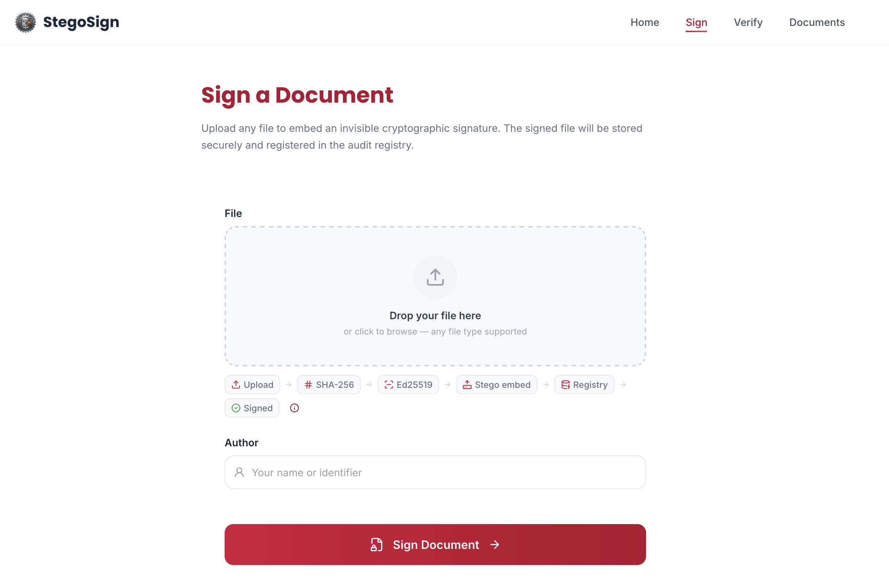
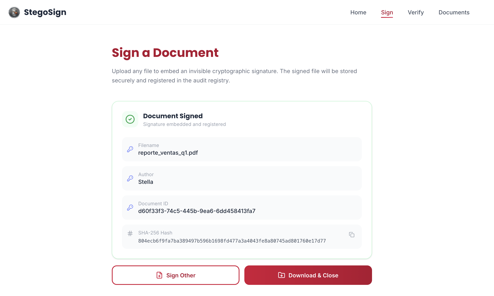
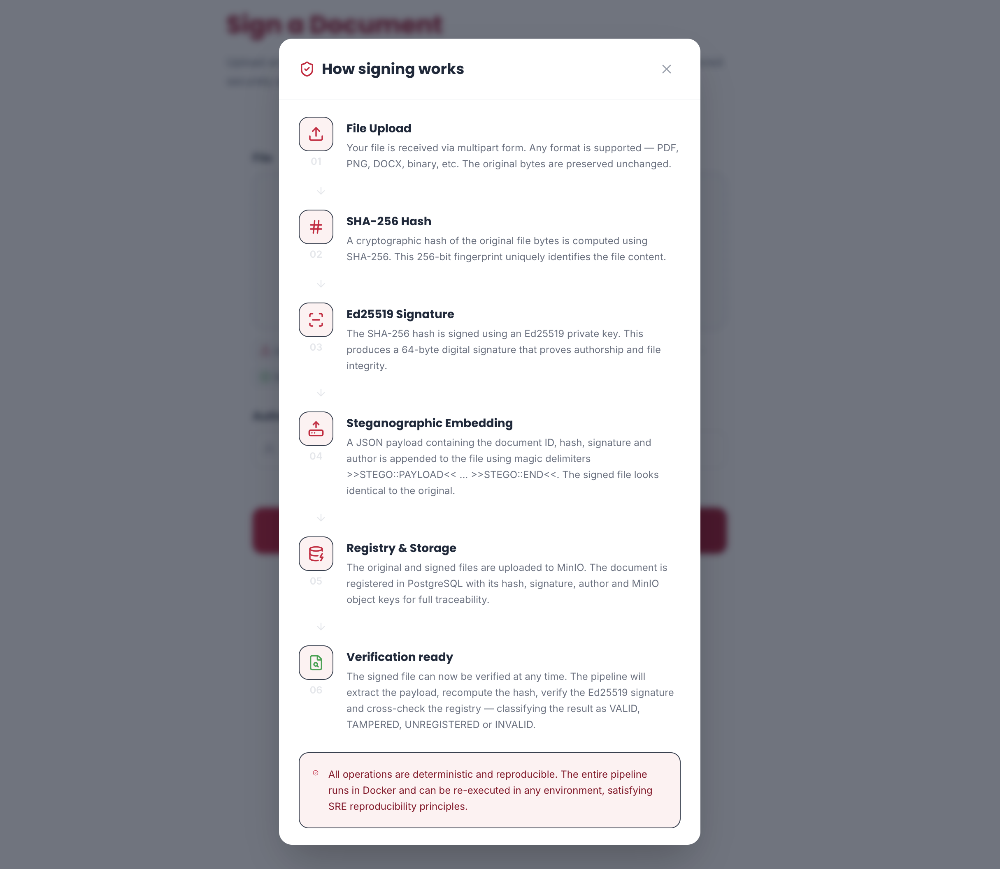

1. **File Upload** — the file is received via multipart form. Any format is supported: PDF, PNG, DOCX, binary, etc. The original bytes are preserved unchanged.
2. **SHA-256 Hash** — a cryptographic hash of the original file bytes is computed. This 256-bit fingerprint uniquely identifies the file content.
3. **Ed25519 Signature** — the SHA-256 hash is signed using the Ed25519 private key, producing a 64-byte digital signature that proves authorship and integrity.
4. **Steganographic Embedding** — a JSON payload containing the document ID, hash, signature and author is appended to the file using magic delimiters `>>STEGO::PAYLOAD<< ... >>STEGO::END<<`. The signed file looks identical to the original.
5. **QR Watermark (PDF only)** — a QR code pointing to the verification URL is generated and inserted as a visible watermark in the PDF.
6. **Registry & Storage** — the original and signed files are uploaded to S3/AIStor. The document is registered in PostgreSQL with its hash, signature, author, and object keys for full traceability.

---

## Verification Flow

> How verification works — step by step

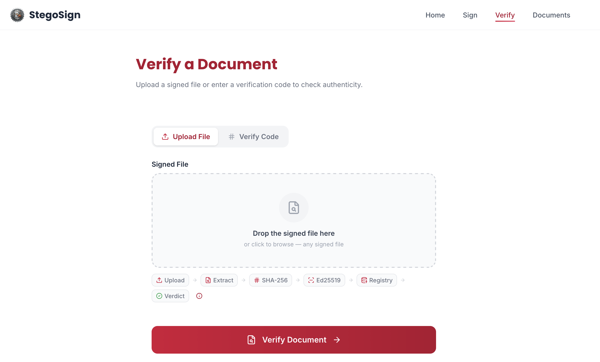
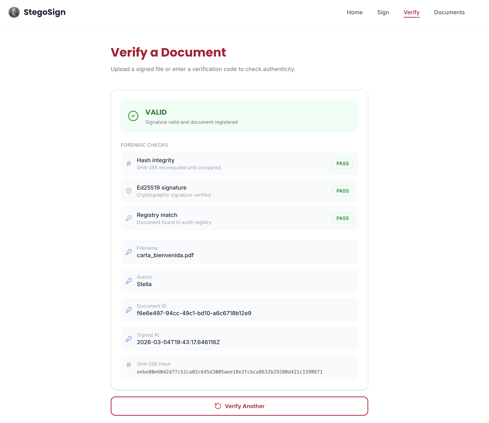
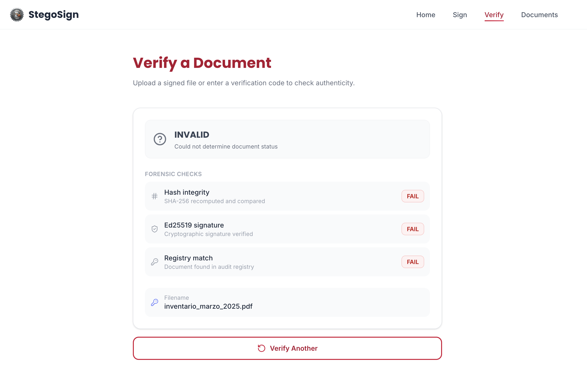
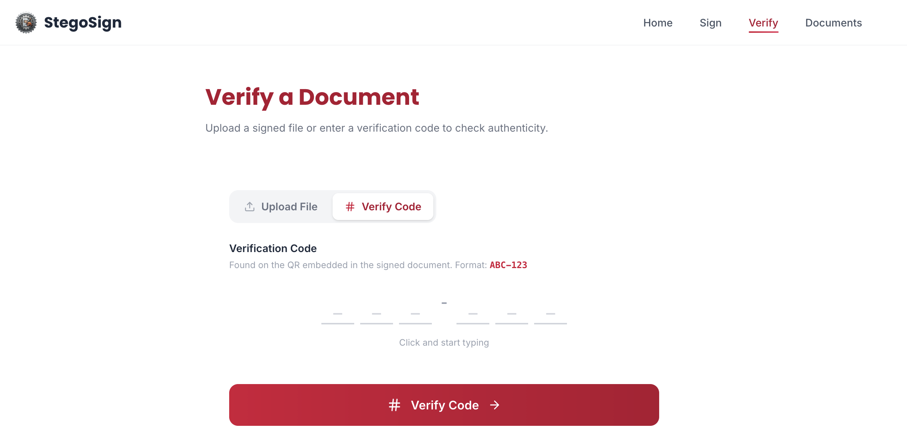
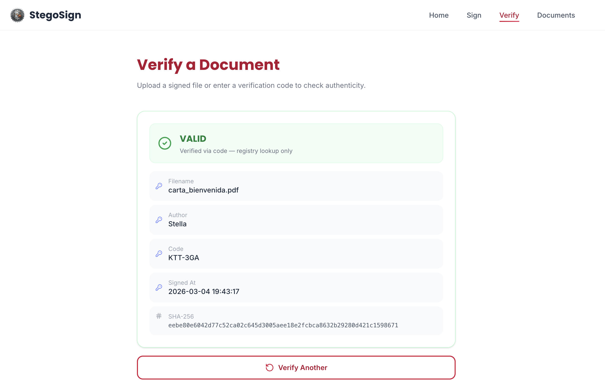
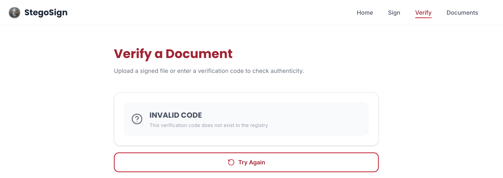
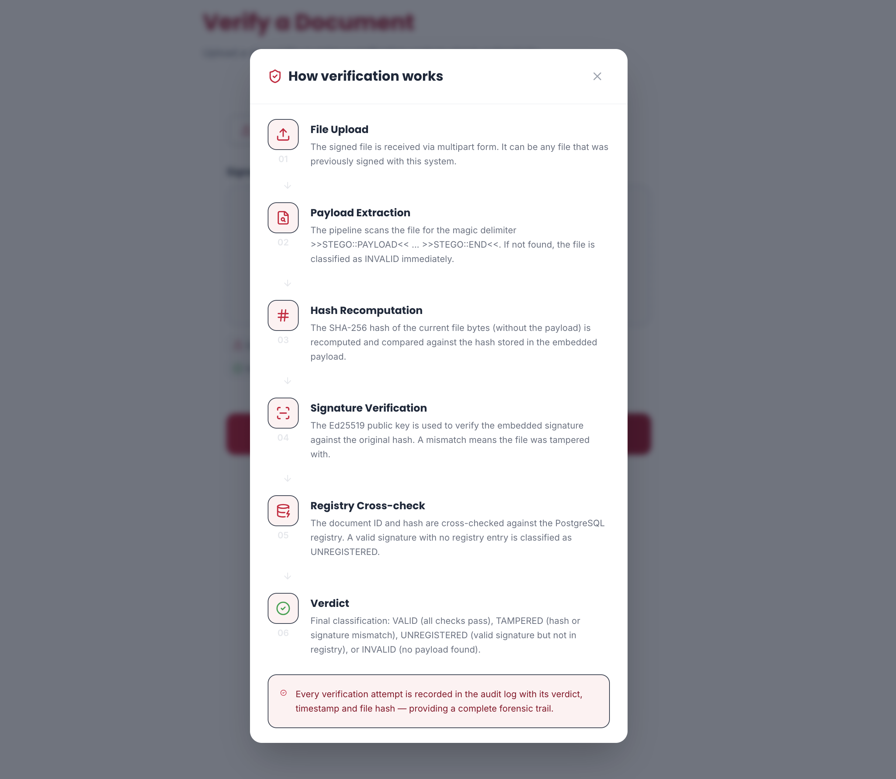

**By file upload:**

1. **Payload Extraction** — the pipeline scans the file for the magic delimiter `>>STEGO::PAYLOAD<<`. If not found, the file is classified as `INVALID` immediately.
2. **Hash Recomputation** — the SHA-256 hash of the current file bytes (without the payload) is recomputed and compared against the hash stored in the embedded payload.
3. **Signature Verification** — the Ed25519 public key is used to verify the embedded signature against the original hash. A mismatch means the file was tampered with.
4. **Registry Cross-check** — the document ID and hash are cross-checked against the PostgreSQL registry. A valid signature with no registry entry is classified as `UNREGISTERED`.
5. **Verdict** — final classification: `VALID`, `TAMPERED`, `UNREGISTERED`, or `INVALID`.

**By verification code:**

Each signed PDF contains a QR code with a 6-character code (e.g. `ABC-123`). This code can be entered directly in the verify page without uploading the file.

> Every verification attempt is recorded in the audit log with its verdict, timestamp and file hash — providing a complete forensic trail.

---

## Document Registry

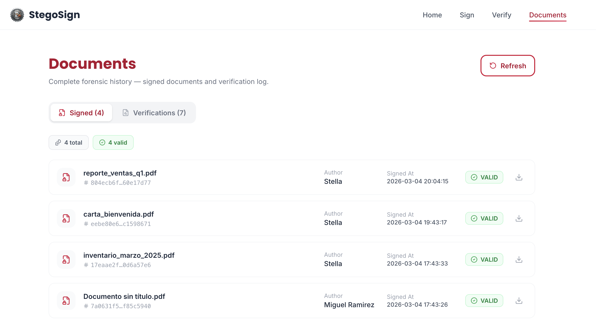
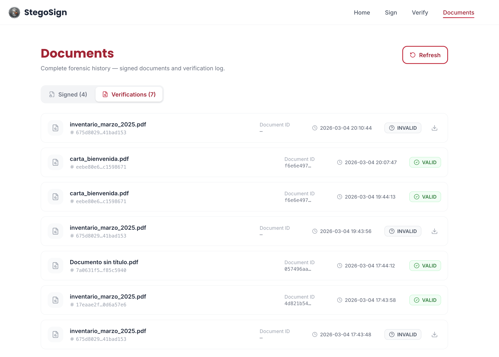

The registry page shows the complete forensic history: all signed documents and all verification attempts, with status, author, timestamp and SHA-256 hash.

---

## Application

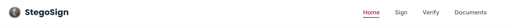
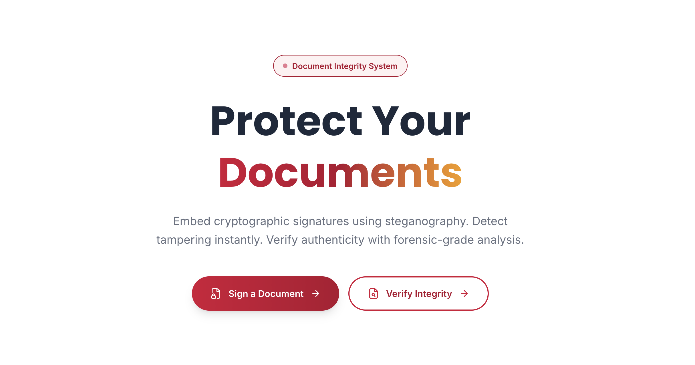
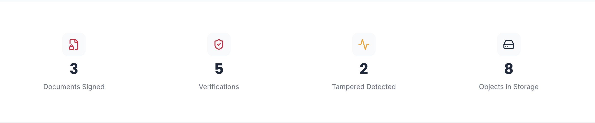
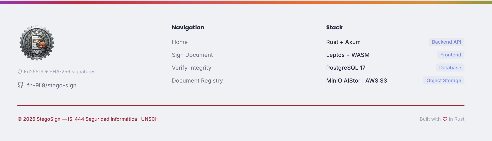

---

## Project Structure

```
stego-sign/
├── server/          # rust + axum REST api
│   ├── src/
│   │   ├── handlers/    # sign, verify, documents, stats, registry
│   │   ├── services/    # crypto, stego, storage, watermark, qr
│   │   ├── repositories/
│   │   └── config/
│   └── migrations/  # schema_files.sql, schema_app.sql
├── app/             # leptos + wasm frontend
│   └── src/
│       ├── features/    # home, sign, verify, documents
│       └── config.rs    # api_base_url (ssr/csr)
├── docker-compose.yml
├── docker-compose.swarm.yml
├── Makefile
└── .env
```

---

## Local Development

### Prerequisites

```bash
# rust
rustup target add wasm32-unknown-unknown
cargo install cargo-leptos --locked

# docker
docker compose version
```

### Setup

```bash
cp .env.example .env
# edit .env — at minimum set POSTGRES_PASSWORD, STORAGE_ACCESS_KEY, STORAGE_SECRET_KEY
```

### Start infrastructure

```bash
make up-infra       # starts db + aistor
```

### Run server and app

```bash
# terminal 1
make dev-server     # cargo run in /server — http://localhost:4000

# terminal 2
make dev-app        # cargo leptos watch in /app — http://localhost:3000
```

### Generate signing keys (first time)

```bash
make keygen
# copy SIGNING_KEY and VERIFY_KEY to .env
```

---

## Deployment

See [DEPLOY.md](DEPLOY.md) for the complete deployment guide including Docker Compose, first-run migrations, key generation, and Docker Swarm / Dokploy instructions.

### Quick deploy with AIStor

```bash
make deploy-aistor
make migrate
make keygen         # copy keys to .env
make recreate-server
```

### Quick deploy with AWS S3

```bash
make deploy-aws
make migrate
make keygen         # copy keys to .env
make recreate-server
```

---

## API

| method | route | description |
|--------|-------|-------------|
| `GET` | `/health` | server, db and storage status |
| `POST` | `/api/v1/sign` | sign a document |
| `POST` | `/api/v1/verify` | verify document integrity |
| `GET` | `/api/v1/verify/code/{code}` | verify by QR code |
| `GET` | `/api/v1/documents` | list all documents |
| `GET` | `/api/v1/documents/{id}` | get document by id |
| `GET` | `/api/v1/documents/{id}/audit` | audit log for a document |
| `GET` | `/api/v1/documents/{id}/download` | download signed file |
| `GET` | `/api/v1/stats` | global statistics |
| `GET` | `/api/v1/registry` | full document registry |
| `GET` | `/api/v1/admin/keygen` | generate Ed25519 key pair (dev only) |

---

## Makefile

```bash
make help            # show all available commands
make up              # start all services
make deploy-aistor   # deploy with local aistor storage
make deploy-aws      # deploy with aws s3 (no aistor)
make migrate         # apply database migrations
make migrate-fresh   # drop and re-apply all schemas
make keygen          # generate ed25519 key pair
make recreate-server # force recreate server (picks up new env vars)
make logs s=server   # follow server logs
make down-v          # stop all and remove volumes
```

---

## License

Academic project — IS-444 Seguridad Informática · UNSCH · 2026
